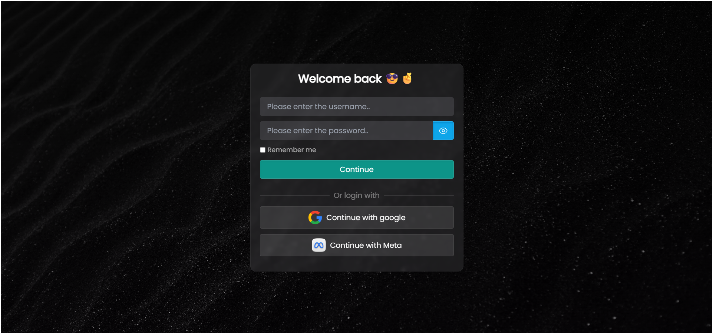

# Smart Login Form

A modern and responsive login form built with HTML, CSS, and JavaScript.  
It features a **show/hide password toggle**, clean UI, and a smooth user experience.

## Features

- Responsive design for desktop and mobile
- Show/hide password functionality
- Custom input styles
- Clean and modern layout

## Technologies Used

- HTML5
- CSS3
- JavaScript

## Screenshot



## Usage

1. Clone the repository:
   ```bash
   git clone https://github.com/00mohammad/Smart-Login-Form.git
